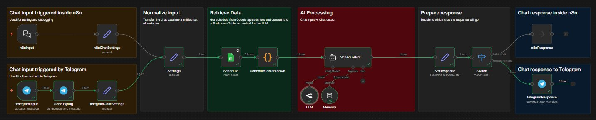
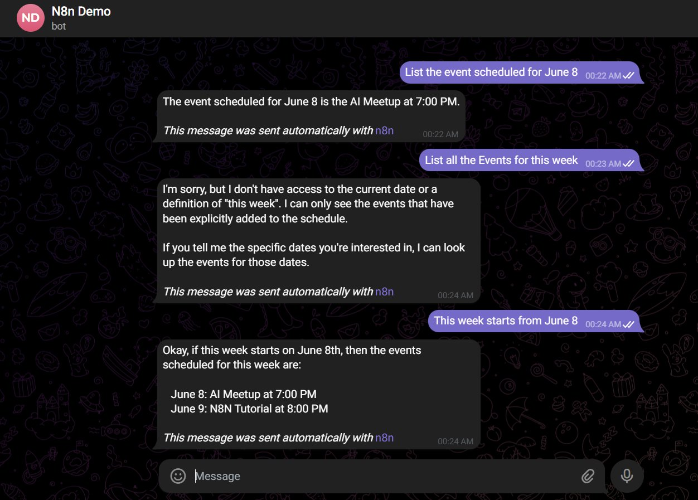

# SheetChat-TG AI: Chat with Your Google Sheets Schedule in Telegram using n8n, OpenRouter & Memory

An AI-powered Telegram chatbot built with **n8n**, **Google Sheets**, **OpenRouter**, and **Conversation Memory**.

The bot reads event schedules from a Google Spreadsheet, converts the schedule into structured context, sends it to an LLM through OpenRouter, and returns intelligent answers directly inside Telegram.

---

## Features

- Telegram Bot Integration
- Google Sheets as Knowledge Base
- AI-Powered Schedule Q&A
- Persistent Conversation Memory
- Multi-Turn Conversations
- OpenRouter Integration
- Dynamic Schedule Updates
- Context-Aware Responses
- Easy Deployment using ngrok

---

## Tech Stack

| Layer | Technology |
|---|---|
| Automation Platform | n8n |
| Messaging | Telegram Bot API |
| Data Source | Google Sheets API |
| LLM Provider | OpenRouter |
| Model | Google Gemini 2.5 Flash Lite |
| Auth | OAuth 2.0 |
| Tunnel (local dev) | ngrok |
| Scripting | JavaScript |

---

## Workflow



The pipeline has five stages:

```
Telegram User
      │
      ▼
Telegram Trigger (+ Typing Indicator)
      │
      ▼
Normalize Input (unify chatId, message, mode)
      │
      ▼
Google Sheets -> Markdown Conversion
      │
      ▼
OpenRouter LLM + Window Buffer Memory
      │
      ▼
Switch (n8n mode / Telegram mode)
      │
      ▼
Telegram Response
```

---

## Demo

### Example Spreadsheet

| Date   | Event        | Time    |
|--------|--------------|---------|
| June 8 | AI Meetup    | 7:00 PM |
| June 9 | N8N Tutorial | 8:00 PM |



---

## Conversation Memory

The workflow uses n8n's **Buffer Window Memory** node. Each Telegram user gets an independent memory session, keyed by their chat ID:

```
session key = chatId + '-v2'
```

This means follow-up questions work naturally - the bot remembers what was said earlier in the same conversation.

**Resetting memory:** Change `-v2` to `-v3` (or any new suffix) in the Memory node's session key to start all sessions fresh. You can also add a `/reset` command inside the workflow for per-user resets.

---

## Installation Guide

### Step 1 - Install and start n8n

```bash
npm install -g n8n
n8n
```

n8n runs on `http://localhost:5678` by default.

---

### Step 2 - Expose n8n with ngrok

Telegram needs a public HTTPS URL to send webhook events to your local n8n instance. ngrok creates a secure tunnel for this.

1. Sign up at [ngrok.com](https://ngrok.com) and get your auth token.
2. Authenticate:
   ```bash
   ngrok config add-authtoken YOUR_NGROK_TOKEN
   ```
3. Start the tunnel:
   ```bash
   ngrok http 5678
   ```
4. Copy the generated URL, for example:
   ```
   https://your-subdomain.ngrok-free.app
   ```
   Keep this terminal open - ngrok must stay running while you use the bot.

> **Note:** The free ngrok URL changes every time you restart. For a permanent URL, use a paid ngrok plan or a self-hosted n8n instance.

---

### Step 3 - Create a Telegram Bot

1. Open Telegram and search for `@BotFather`.
2. Send `/newbot` and follow the prompts.
3. Copy the **Bot Token** - you will need it in Step 7.

---

### Step 4 - Set up Google Cloud OAuth

This gives n8n permission to read your Google Sheets.

#### 4.1 - Create a project

Go to [Google Cloud Console](https://console.cloud.google.com) and create a new project.

#### 4.2 - Enable the Sheets API

Go to **APIs & Services -> Library**, search for **Google Sheets API**, and click **Enable**.

#### 4.3 - Configure the OAuth consent screen

Go to **APIs & Services -> OAuth consent screen** (or **Google Auth Platform -> Audience**):

- User Type: **External**
- Publishing Status: **Testing**
- Add your own Gmail address as a **Test User**

#### 4.4 - Create an OAuth Client ID

Go to **APIs & Services -> Credentials -> Create Credentials -> OAuth Client ID**:

- Application type: **Web application**
- Under **Authorized redirect URIs**, add:
  ```
  https://YOUR-NGROK-DOMAIN/rest/oauth2-credential/callback
  ```
  Example:
  ```
  https://your-subdomain.ngrok-free.app/rest/oauth2-credential/callback
  ```

Save and copy the **Client ID** and **Client Secret**.

> **Important:** Every time your ngrok URL changes, you must update this redirect URI in Google Cloud Console.

---

### Step 5 - Create the Schedule Spreadsheet

Create a Google Sheet with this structure:

| Date   | Event        | Time    |
|--------|--------------|---------|
| June 8 | AI Meetup    | 7:00 PM |
| June 9 | N8N Tutorial | 8:00 PM |

- The first row must be a header row.
- Add as many event rows as needed.
- Make sure the sheet is accessible by the Google account you will authenticate with.

Copy the spreadsheet URL - you will need it in Step 9.

---

### Step 6 - Get an OpenRouter API Key

1. Sign up at [openrouter.ai](https://openrouter.ai).
2. Go to **Keys -> Create Key**.
3. Copy the API key.

---

### Step 7 - Configure credentials in n8n

Open n8n at `http://localhost:5678` and go to **Settings -> Credentials**.

**Telegram API**
- Create a new **Telegram API** credential.
- Paste your Bot Token from Step 3.

**Google Sheets OAuth2 API**
- Create a new **Google Sheets OAuth2 API** credential.
- Paste the Client ID and Client Secret from Step 4.
- Click **Connect my account** and complete the Google login flow.

**OpenRouter API**
- Create a new **OpenRouter API** credential.
- Paste your API key from Step 6.

---

### Step 8 - Import the workflow

In n8n, go to **Workflows -> Import from file** and select the `.json` file.

After importing, assign credentials to the nodes:

- `telegramInput`, `SendTyping`, `telegramResponse` - Telegram API
- `Schedule` - Google Sheets OAuth2 API
- `LLM` - OpenRouter API

---

### Step 9 - Update the spreadsheet URL

Open the **Settings** node and update `scheduleURL` to your spreadsheet URL:

```
https://docs.google.com/spreadsheets/d/YOUR_SHEET_ID_HERE
```

Also update the same URL in the **Schedule** node's document URL field.

---

### Step 10 - Activate and test

1. Toggle the workflow **ON** in n8n.
2. Open your Telegram bot and send a message:
   ```
   What events are scheduled?
   ```
3. The bot will read your sheet and respond instantly.

---

## Example Queries

```
What events are scheduled this week?
What is happening on June 8?
When is the AI Meetup?
What time does the N8N Tutorial start?
Summarize all upcoming events.
```

---

## Author

**Vasu Goel**

[](mailto:vasugoel2754@gmail.com)
[](https://www.linkedin.com/in/vasugoel503/)
[](https://github.com/vasug27)